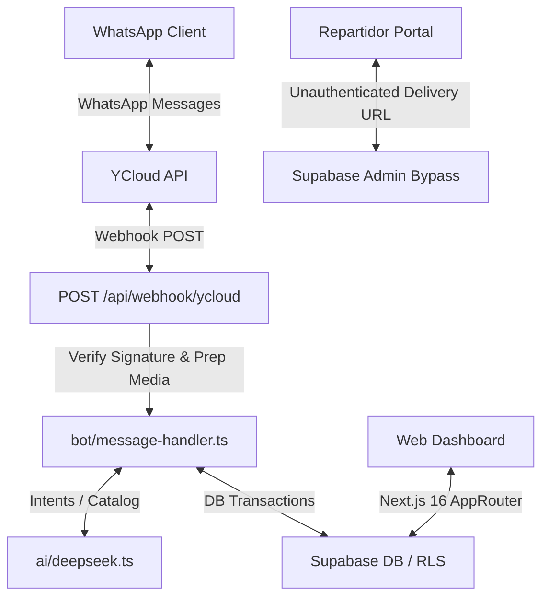

# FerroBot Developer Context Sheet (`CLAUDE.md`)

This document serves as the single source of truth for developer guidelines, architecture, database schemas, and conventions when working on **FerroBot**.

---

## 🛠️ Commands & Development Lifecycle

Use the following commands for development, building, and validation:

| Task | Command | Description |
|---|---|---|
| **Development** | `npm run dev` | Starts the Next.js 16 development server with Turbopack. |
| **Production Build** | `npm run build` | Builds the production bundle. Run this locally to catch TypeScript and pre-rendering issues. |
| **Linting** | `npm run lint` | Runs ESLint configuration. |
| **Start Production** | `npm run start` | Starts the built server in production mode. |

> [!IMPORTANT]
> **No Automated Tests**: The codebase currently relies on build validation. Always run `npm run build` to catch compile-time, TypeScript, and pre-rendering exceptions before pushing code or deploying.

---

## 🏗️ Architecture Overview

**FerroBot** is a multi-tenant SaaS application specifically built for Peruvian hardware stores (*ferreterías*). It bridges a conversational WhatsApp AI interface with a web dashboard for store owners and staff to manage catalog, orders, deliveries, and billing.



### 1. Multi-tenancy & Auth

Every database table is scoped to a tenant (`ferreteria_id`). Data segregation is strictly enforced via Supabase Row Level Security (RLS) policies and session scoping.

* **Central Auth Utility**: `src/lib/auth/roles.ts → getSessionInfo()`
  * Returns: `{ userId, ferreteriaId, rol: 'dueno'|'vendedor', nombreFerreteria, onboardingCompleto, permisos }`
  * Strategy: It checks if the user is the owner (`ferreterias.owner_id`). If not, it checks the `miembros_ferreteria` table for employee assignments.
  * **Use this in all server components and API routes** instead of querying `ferreterias` directly.
* **Routing & Middleware**: Controlled by `src/proxy.ts` (mapped from Next.js middleware hooks).
  * Excludes standard assets.
  * Public routes (auth, webhooks, delivery tracking) are registered in `RUTAS_PUBLICAS` to bypass redirect logic.

### 2. Supabase Client Tiers

To interact with Supabase, choose the appropriate client creation method:

```typescript
// 1. Server Client (scoped to user session, enforces RLS)
import { createClient } from '@/lib/supabase/server'
const supabase = await createClient()

// 2. Admin Client (bypasses RLS, server-only, secure environments)
import { createAdminClient } from '@/lib/supabase/admin'
const supabaseAdmin = createAdminClient()

// 3. Client-side Client (for browser interactive client components)
import { createClient } from '@/lib/supabase/client'
const supabase = createClient()
```

---

## 🛢️ Database Schema Summary

Key database tables configured in the `supabase/migrations/` directory:

| Table | Multi-tenant Key | Description | RLS Policy |
|---|---|---|---|
| **`ferreterias`** | `owner_id` | Master tenant record for each store. | `owner_id = auth.uid()` |
| **`miembros_ferreteria`** | `ferreteria_id` | Associates employees with roles and JSONB permissions. | Scoped to `mi_ferreteria_id()` |
| **`productos`** | `ferreteria_id` | Catalog of items with prices, stock, and negotiation parameters. | Scoped to `mi_ferreteria_id()` |
| **`conversaciones`** | `ferreteria_id` | Sessions of chat history between clients and the store. | Scoped to `mi_ferreteria_id()` |
| **`mensajes`** | - | Message history. References `conversaciones(id)`. | Scoped via conversation RLS |
| **`cotizaciones`** | `ferreteria_id` | Quotes containing lines of item data, prices, and status. | Scoped to `mi_ferreteria_id()` |
| **`pedidos`** | `ferreteria_id` | Confirmed purchases mapped for delivery or pickup. | Scoped to `mi_ferreteria_id()` |
| **`suscripciones`** | `ferreteria_id` | Track credit quotas (AI calls) and SaaS subscription levels. | Scoped via owner auth |

> [!TIP]
> **RLS Helper**: The SQL helper function `mi_ferreteria_id()` returns the `ferreteria_id` associated with the currently authenticated `auth.uid()`. It is heavily used in policies.

---

## 💬 WhatsApp AI Webhook & Flow

Incoming WhatsApp events hit `POST /api/webhook/ycloud`:
1. **HMAC Signature Check**: Validated against `YCLOUD_WEBHOOK_SECRET`.
2. **Media Pre-processing**:
   * Audio messages (.ogg / .mp3) -> Transcribed using OpenAI Whisper API.
   * Image messages -> Analyzed via GPT-4o Vision to extract item details or lists.
   * Both steps require `OPENAI_API_KEY` and degrade gracefully if omitted.
3. **Core Message Processing**:
   * Message sent to `src/lib/bot/message-handler.ts → handleIncomingMessage()`.
   * Intent parsing via DeepSeek (`src/lib/ai/deepseek.ts`) returns a structured JSON.
   * Handler updates Supabase and dispatches outgoing messages through YCloud API.

### Pausing the Bot
When `bot_pausado = true` (either through owner dashboard manual takeover or AI `pedir_humano` intent detection), the bot ceases automatic replies to let a human manage the conversation.

---

## 🚚 Delivery & Repartidores System

* **No Credentials Auth**: Repartidores (delivery agents) do not have Supabase accounts.
* **Token Authentication**: They authenticate via a cryptographically secure URL token: `/delivery/[token]`.
* **API Access**: APIs serving these routes (`/api/delivery/[token]/*`) use `createAdminClient()` and bypass normal RLS checks, verifying the token validity explicitly.

---

## 📋 Coding Conventions & Guidelines

* **Next.js 16 Search Params**: Next.js 16 enforces that **any component reading `useSearchParams()` must be wrapped in a `<Suspense>` boundary**. Failing to do so will cause pre-rendering failures during `npm run build`.
* **Phone Formats**: Always store phone numbers as raw numeric E.164 strings without the leading `+` (e.g., `51987654321` for Peru). The webhook handler and YCloud adapter handle appending `+` prefix where needed.
* **Timezone Rules**: All business hours, scheduling, and billing timestamps use the Lima timezone (`America/Lima`, UTC-5).
* **Billing & SUNAT**: Invoices (boletas/facturas) are generated, saved, and processed under `src/lib/comprobantes` and `src/lib/sunat/` utilizing `@react-pdf/renderer` for template exports.

---

## 🔑 Environment Variables

```bash
# Supabase Configuration
NEXT_PUBLIC_SUPABASE_URL=            # URL of Supabase project
NEXT_PUBLIC_SUPABASE_ANON_KEY=       # Anonymous client key
SUPABASE_SERVICE_ROLE_KEY=           # Secret admin key (server-only)

# WhatsApp & Integrations
YCLOUD_API_KEY=                      # YCloud API communication key
YCLOUD_WEBHOOK_SECRET=               # HMAC verification key for webhooks

# AI Engine Credentials
DEEPSEEK_API_KEY=                    # Used for core intent and processing
OPENAI_API_KEY=                      # Optional: enables Whisper and Vision support

# Dashboard Context
NEXT_PUBLIC_APP_URL=                 # Base URL for invitation/delivery links
CRON_SECRET=                         # Bearer token protecting cron endpoints
```
